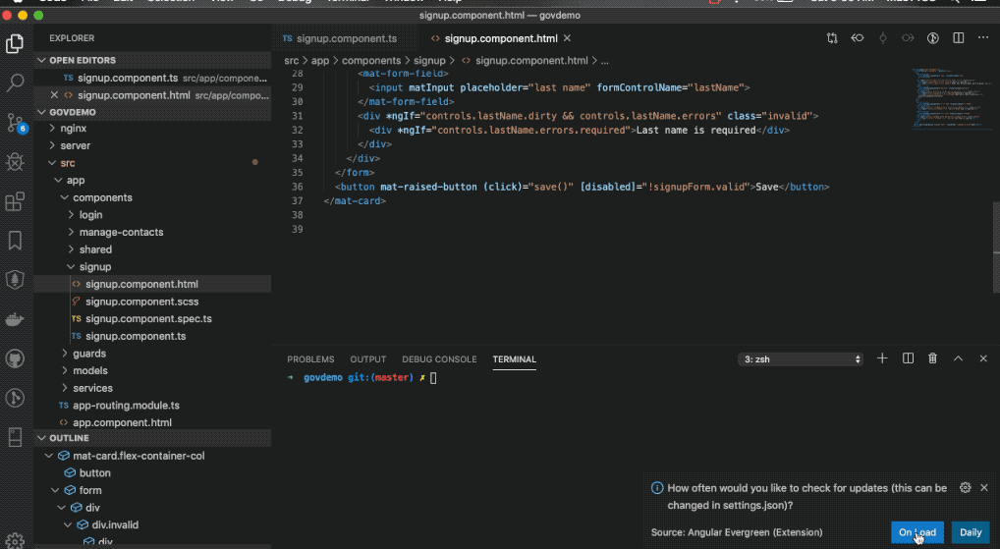

#  Angular Evergreen [](https://circleci.com/gh/expertly-simple/angular-evergreen/tree/master)

Keep your project's version of Angular and related packages evergreen with periodic update checks and upgrade your Angular CLI projects with ease.



## Features

- Launch Angular Evergreen
  - Schedules a `Check for Angular Updates` every 24 hours.
  - Stop command, cancels scheduled checks for updates
- Check for Angular Updates
  - Manually run to see if there are updates
  - Checks to see if git branch is clean
  - Executes `npm install`
  - Runs `ng update --all`
- Subscribe to `latest` or `next` update channels

## Upcoming Features

- Ability to rollback upgrades (partial rollback in 0.7)
- Assist users clean git branch before update

_Have a feature request or submit a PR?_ Submit an issue/PR on GitHub [here](https://github.com/expertly-simple/angular-evergreen/issues).

## Requirements

Projects setup with `@angular/cli` package.

## Extension Settings

```
{
  "ng-evergreen.upgradeChannel": "Latest" | "Next"
}
```

## Release Notes

### 0.9

- Re-organized UI
- Added more convenience commands
- Implemented ability to view available packages
- Fixed bug where terminal would always open on launch

### 0.8

- Improved update check speed
- Implemented sidebar UI
- Removed check frequency to always check on load
- Improved stability

### 0.7.0

- Select upgrade channel `Latest` or `Next`
- Ability to skip a release and be notified on the next release
- More reliable upgrade check algorithm
- More reliable upgrade algoritm with git commits, removing uncommited files and more informative force guidance to restore TypeScript state
- Fixed runtime bug on Windows 10

### 0.6.0

- Check frequency setting to remember your preffered update check frequency
- No longer nags at every launch
- Help run `--force` when update fails

### 0.5.2

Initial beta release with git clean check, scheduled and manually triggered basic ng update capability.

## Contributors

- [@duluca](http://github.com/duluca)
- [@kentonbmax](http://github.com/kentonbmax)
- [@brendoncaulkins](http://github.com/brendoncaulkins)
- [@alexhoffman617](http://github.com/alexhoffman617)
- [@bjsawyer](https://github.com/bjsawyer)

## Attributions

See the file named THIRDPARTY for attributions.
