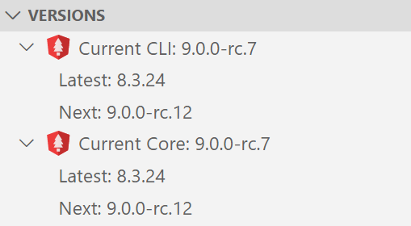

#  Angular Evergreen [](https://circleci.com/gh/expertly-simple/angular-evergreen/tree/master)

Keep your project's version of Angular and related packages evergreen, keep your settings in sync, and upgrade your Angular CLI projects with ease.


## Features

Angular Evergreen makes it easier to configure, update, and test your Angular CLI projects.

- Configure your Angular project for VS Code settings

  - Run `Configure VS Code for Angular` and keep your config in sync across projects

    [`mrm-task-angular-vscode`](https://www.npmjs.com/package/mrm-task-angular-vscode) Configures:

    - common Npm packages: [cross-conf-env](https://www.npmjs.com/package/cross-conf-env), [npm-run-all](npm-run-all), [dev-norms](https://www.npmjs.com/package/dev-norms), [rimraf](https://www.npmjs.com/package/rimraf)
    - Npm scripts for styling, and linting
    - ImportSort
    - TsLint
    - Prettier
    - JsBeautify
    - Jasmine and nyc
    - Example.env
    - PR template
    - Angular libraries: [angular-unit-test-helper](https://www.npmjs.com/package/angular-unit-test-helper)
    - VsCode extensions, settings, and launch for debugging

- Keep Angular Evergreen
  - See the `latest` and `next` versions of Angular in your IDE

  

  - Right click directly in your `angular.json` file to see which packages need to be updated
- Run Post-Update Checkup
  - With one-click, run your unit tests, and build your Angular project in `prod` mode to ensure that your update went smoothly

## Upcoming Features

- Support for multi-root projects and non-standard folder structures

_Have a feature request or submit a PR?_ Submit an issue/PR on GitHub [here](https://github.com/expertly-simple/angular-evergreen/issues/new).

## Requirements

Projects setup with `@angular/cli` package.

## Extension Settings

```
{
  "ng-evergreen.upgradeChannel": "Latest" | "Next"
}
```

## Release Notes

### 1.0

- Improved UX to make it clear user is about to run a command
- Improved icon contrast
- Added npm check updates command
- Check if git status clean before running certain quick commands

### 0.9

- Re-organized UI
- Added more convenience commands
- Implemented ability to view available packages
- Fixed bug where terminal would always open on launch

### 0.8

- Improved update check speed
- Implemented sidebar UI
- Removed check frequency to always check on load
- Improved stability

### 0.7.0

- Select upgrade channel `Latest` or `Next`
- Ability to skip a release and be notified on the next release
- More reliable upgrade check algorithm
- More reliable upgrade algoritm with git commits, removing uncommited files and more informative force guidance to restore TypeScript state
- Fixed runtime bug on Windows 10

### 0.6.0

- Check frequency setting to remember your preffered update check frequency
- No longer nags at every launch
- Help run `--force` when update fails

### 0.5.2

Initial beta release with git clean check, scheduled and manually triggered basic ng update capability.

## Contributors

- [@duluca](http://github.com/duluca)
- [@kentonbmax](http://github.com/kentonbmax)
- [@brendoncaulkins](http://github.com/brendoncaulkins)
- [@alexhoffman617](http://github.com/alexhoffman617)
- [@bjsawyer](https://github.com/bjsawyer)
- [@bampakoa](https://github.com/bampakoa)

## Attributions

See the file named THIRDPARTY for attributions.
